# 선한병원 전자결재 시스템 (Frontend)

## 📖 소개

선한병원 내부 직원의 근로계약서 작성, 휴가원 신청/승인, 근무현황표 제출, 동의서 관리 등 병원 내 주요 행정 업무를 디지털화하여 업무 효율을 높이는 전자결재 시스템의 프론트엔드 프로젝트입니다.

---

## 🛠️ 기술 스택

| 구분 | 기술 |
|---|---|
| Framework | React 19 |
| Language | TypeScript |
| Styling | CSS |
| Routing | React Router DOM v7 |
| Data Fetching | Axios |
| PDF 뷰어 | react-pdf, pdfjs-dist |
| 서명 | react-signature-canvas |
| 차트 | Recharts |
| UI 컴포넌트 | Headless UI, Lucide React |

---

## ⚙️ 설치 및 실행 방법

1. **저장소 복제**
    ```bash
    git clone {frontend_repository_url}
    cd {repository_name}
    ```

2. **패키지 설치**
    ```bash
    npm install
    ```

3. **환경 변수 설정**
    - 프로젝트 루트에 `.env` 파일을 생성합니다.
    - 아래 내용을 참고하여 백엔드 API 서버 주소를 입력합니다.
    - 내부망에서 동작합니다.

4. **개발 서버 실행**
    ```bash
    npm start
    ```

---

## ⚙️ 환경 변수 (.env)

```
VITE_API_BASE_URL=localhost:80/api/v1
```

---

## 📜 스크립트 목록

| 명령어 | 설명 |
|---|---|
| `npm start` | 개발 서버를 실행합니다 (HOST=0.0.0.0) |
| `npm run build` | 프로덕션용으로 프로젝트를 빌드합니다 |
| `npm test` | 테스트를 실행합니다 |

---

## ✨ 주요 기능 및 화면

### 1. 로그인 및 회원 등록

- 사원번호(ID)와 비밀번호로 로그인합니다.
- 최초 로그인 시 병원 DB와 연동하여 사용자 정보를 확인하고, 로컬 DB(MariaDB)로 정보를 이전합니다.
- 전화번호(SMS 인증), 주소(카카오 우편번호 서비스), 디지털 서명(캔버스) 등 추가 개인정보를 입력받아 저장합니다.

| 로그인 | 최초 로그인 | 회원 등록 |
|:---:|:---:|:---:|
|  | 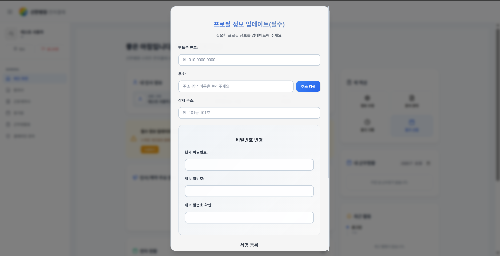 | 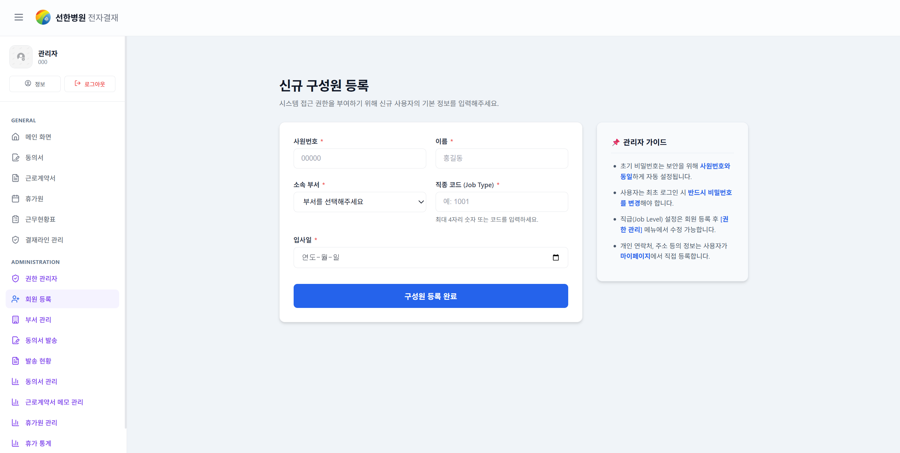 |

---

### 2. 메인 페이지 (대시보드)

- 내 인사 정보(소속, 연락처 등)를 한눈에 확인합니다.
- 문서 보고서: 작성 중 / 진행 중 / 승인대기 / 반려 / 완료 상태별 문서 현황을 표시합니다.
- 연차 현황, 휴가 기록, 정보 수정 등 빠른 액션 버튼을 제공합니다.

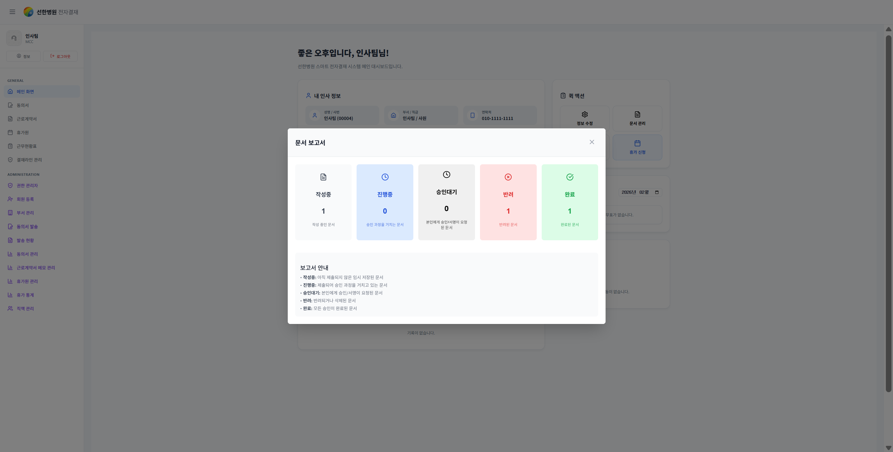

---

### 3. 근로계약서

근로계약서 생성부터 서명 완료까지 전 과정을 디지털로 처리합니다.

#### 관리자 (인사팀)

- 직원 검색 후 계약기간, 연봉, 소정근로시간 등 주요 항목을 입력하여 근로계약서를 생성합니다.
- 이전 계약 데이터를 불러와 재사용할 수 있습니다.
- 반려 시 사유를 작성하여 직원에게 반송합니다.

| 계약서 생성 | 관리자 상세 |
|:---:|:---:|
| 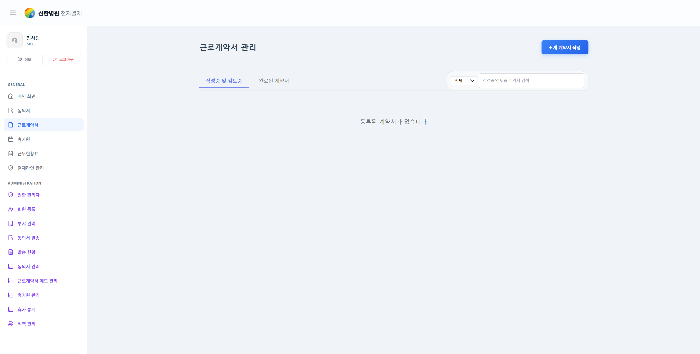 | 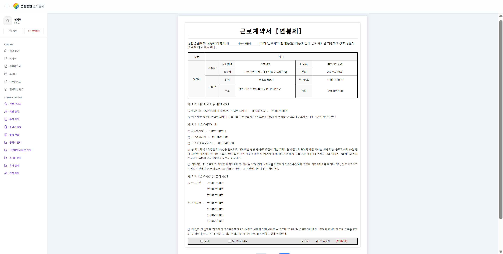 |

#### 직원 (사용자)

- 본인에게 전달된 근로계약서를 열람합니다.
- '개인정보수집 동의' 및 '교부 확인' 문구를 직접 타이핑합니다.
- 등록된 디지털 서명을 사용하여 계약을 완료합니다.

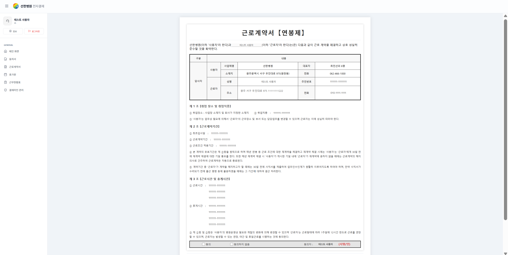

---

### 4. 근로계약서 메모 관리

- 관리자(인사팀)가 근로계약서에 메모를 추가·수정·삭제할 수 있습니다.
- 직원별 계약 관련 특이사항을 기록하여 히스토리 관리에 활용합니다.

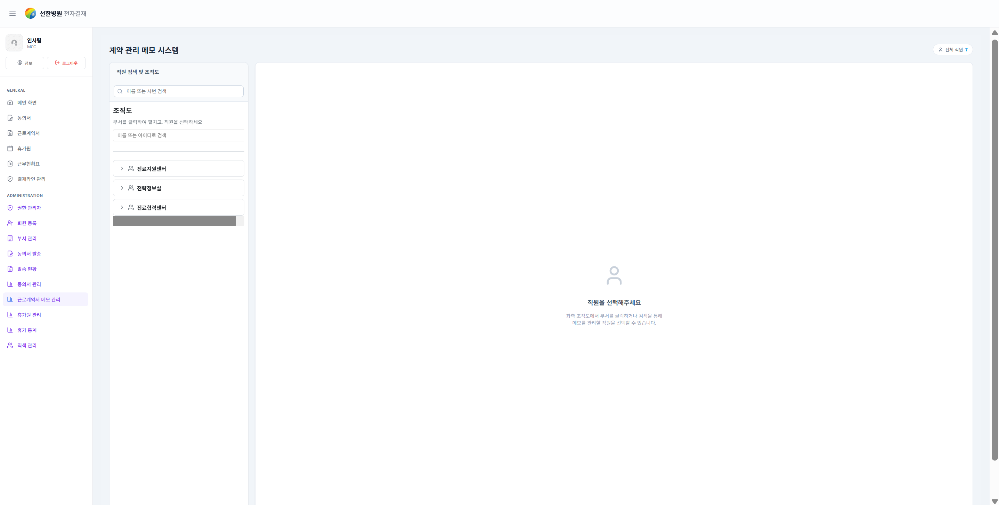

---

### 5. 휴가원 신청 및 결재

#### 직원 (사용자)

- 휴가 유형, 기간, 대직자를 지정하여 휴가원을 작성합니다.
- 직급(일반직원 → 팀장 → 원장)에 따른 다단계 결재 라인을 자동으로 적용합니다.
- 진행 상태(대직자 확인 → 부서장 → 인사팀 → 센터장)를 실시간으로 확인합니다.
- 반려 시 사유를 조회할 수 있습니다.

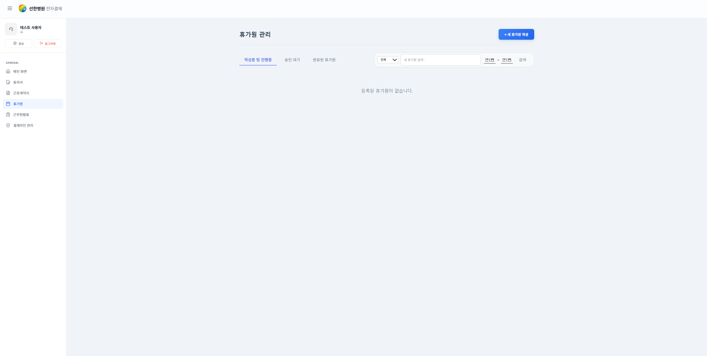

#### 관리자 (인사팀)

- 전체 직원의 휴가원 목록을 조회하고 결재(승인/반려/전결)를 처리합니다.

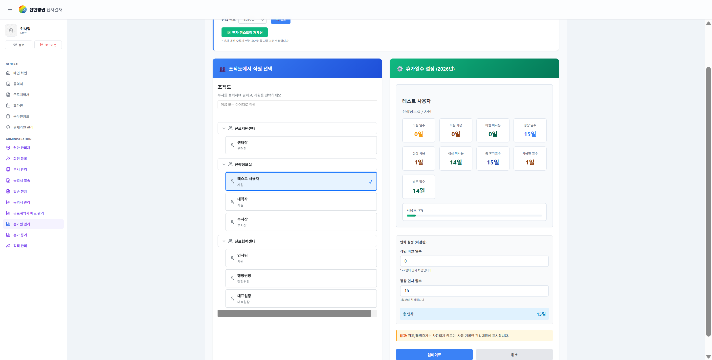

---

### 6. 휴가원 통계

- 부서별·직원별 연차 사용 현황을 조회합니다.
- 특정 직원을 선택하여 상세 휴가 사용 내역을 확인합니다.
- 기간별 휴가 사용 통계를 차트로 시각화합니다.

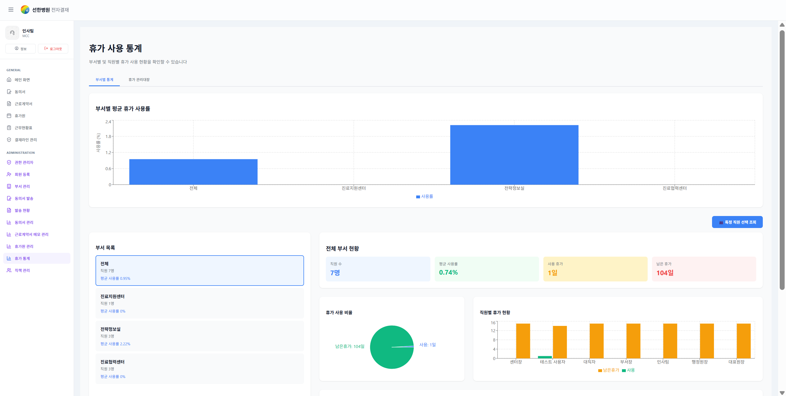

---

### 7. 근무현황표

- 부서 직원들의 월별 근무 스케줄을 표 형태로 입력·관리합니다.
- 부서장 지정, 직책 관리, 당직 설정, 이전 달 데이터 불러오기 기능을 제공합니다.
- 인사팀 검토 → 센터장 승인 → 인사팀 전결 순서의 결재 라인을 따릅니다.
- 최종 승인 후 바탕화면(대시보드) 근무현황 위젯에 반영됩니다.

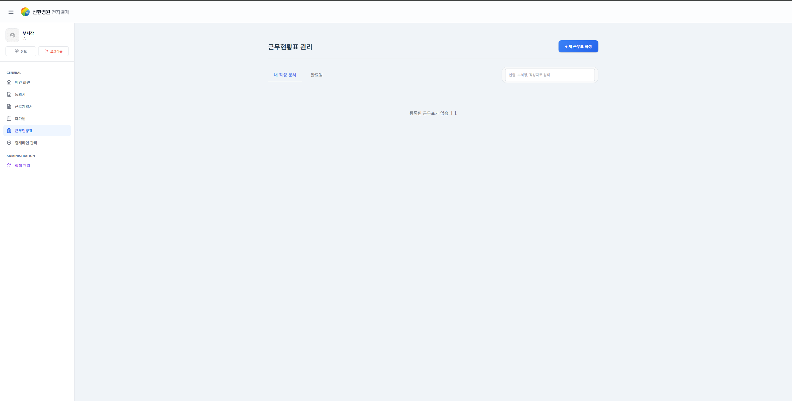

---

### 8. 결재라인 관리

- 사용자가 자신의 결재라인을 직접 생성·수정·삭제할 수 있습니다.
- 휴가원, 근무현황표 등 문서 제출 시 등록된 결재라인을 선택하여 사용합니다.

| 결재라인 목록 | 결재라인 생성 |
|:---:|:---:|
| 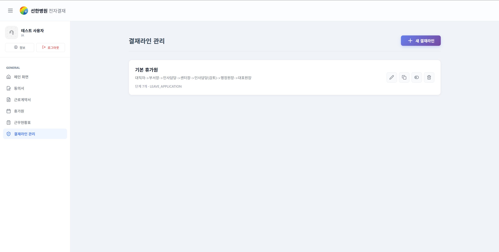 | 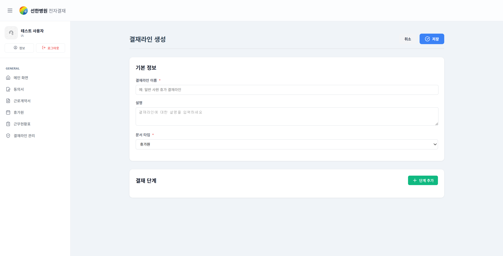 |

---

### 9. 동의서 보관함

#### 직원 (사용자)

- 관리자가 발송한 동의서를 목록에서 확인하고 내용에 서명하여 제출합니다.
- 제출 완료된 동의서는 보관함에서 이력을 조회할 수 있습니다.

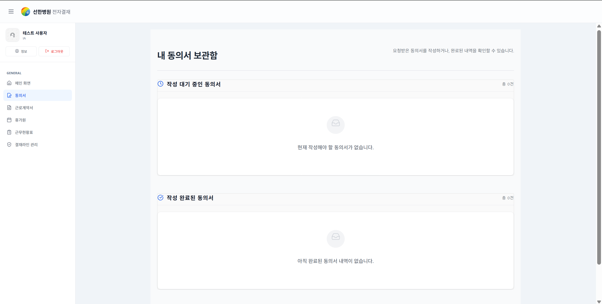

#### 관리자

- 동의서를 작성하여 대상 직원에게 발송합니다.
- 발송 현황 페이지에서 직원별 동의 여부를 실시간으로 확인합니다.

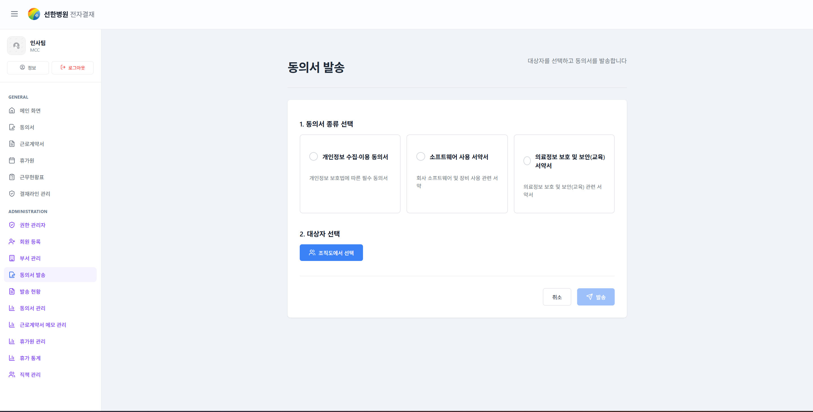

---

### 10. 마이페이지

- 개인정보(연락처, 주소, 비밀번호)를 수정합니다.
- 등록된 디지털 서명을 확인하고 재등록할 수 있습니다.

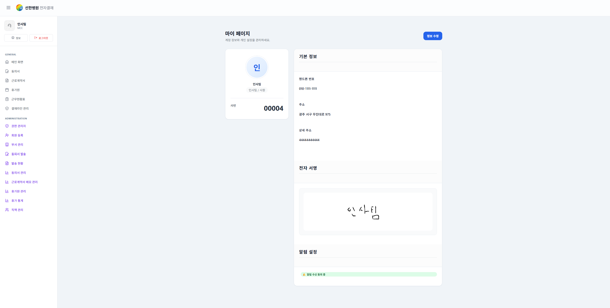

---

### 11. 부서 관리 (관리자)

- 부서를 생성·수정·삭제하고, 부서 간 직원 이동을 처리합니다.

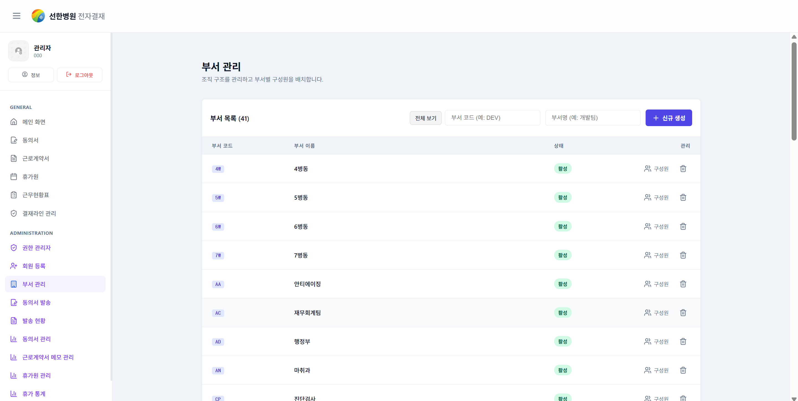

---

### 12. 권한 관리 (관리자)

- 직원별 시스템 권한(일반 사용자 / 인사팀 / 센터장 등)을 부여하거나 변경합니다.

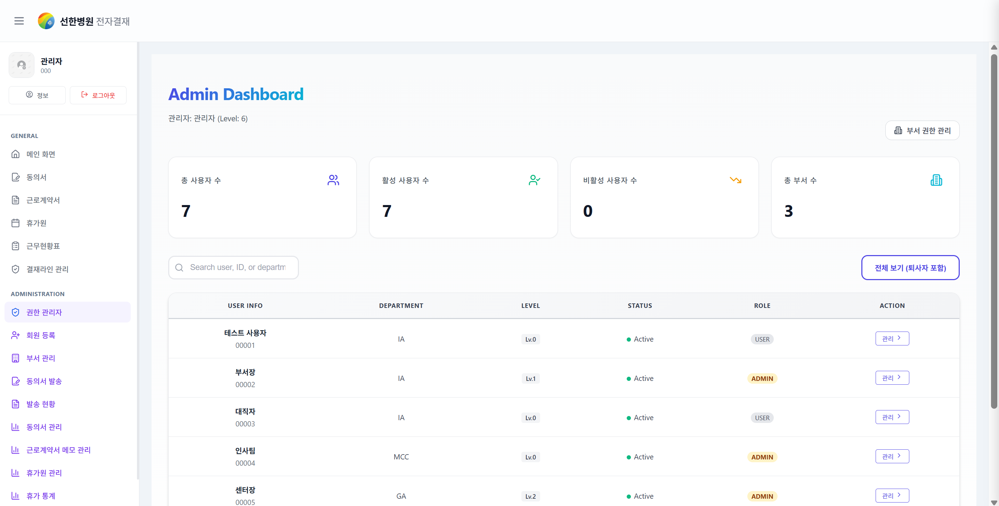

---

## 📁 프로젝트 구조

```
src/
├── components/          # 공통 컴포넌트
│   ├── Layout/          # 사이드바, 레이아웃
│   ├── SideBar/
│   ├── OrgChartModal/   # 조직도 모달
│   ├── ApprovalLineSelector/
│   ├── WorkScheduleBoard/
│   ├── ConsentWritePage/
│   └── ...
├── views/
│   ├── Authentication/  # 로그인
│   │   └── SignIn/
│   └── Detail/
│       ├── MainPage/    # 메인 대시보드
│       ├── MyPage/      # 마이페이지
│       ├── EmploymentContract/  # 근로계약서
│       └── LeaveApplication/   # 휴가원
└── App.tsx              # 라우팅 정의
```

---

## 📄 라이선스 / 문의

- **License**: MIT
- **Contact**: dudgus2109@gmail.com
